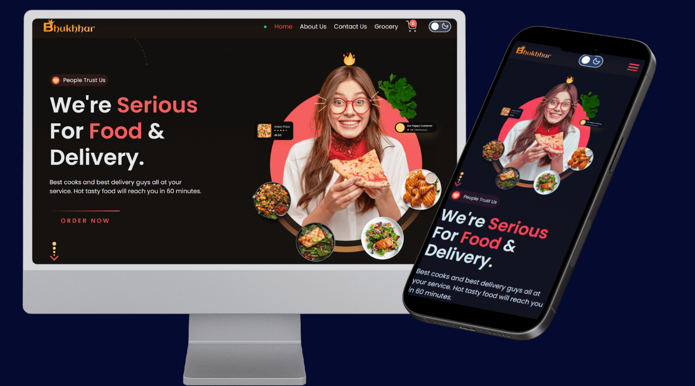

# Food Delivery Website

---



---

## Table of Contents

- [Introduction](#introduction)
- [Features](#features)
- [Technologies Used](#technologies-used)
- [Installation](#installation)
- [Usage](#usage)

## Introduction

Welcome to our food delivery website, a clone of popular platforms like Swiggy and Zomato. This project is designed to offer a seamless and enjoyable experience for users looking to discover new restaurants, place orders. We're committed to providing a user-friendly interface.

## Features

- **User Authentication**: Secure registration and login, with profile management.
- **Restaurant Listing**: Explore a vast selection of restaurants, categorized by cuisine, location, and more.
- **Menu Browsing**: Detailed menus with descriptions, prices, and images.
  <!-- - **Order Placement**: Customize your orders with various options and add-ons. -->
  <!-- - **Order Tracking**: Real-time updates on your order status. -->
  <!-- - **Payment Integration**: Secure and easy payment processing. -->
  <!-- - **Admin Dashboard**: Manage orders, restaurant listings, and user accounts. -->

## Technologies Used

- **Frontend**: ReactJs, Redux, SCSS, TailwindCSS, Vite
- **APIs**: Uesing Swiggy API to fetch the restaurant data
- **API Use in this**: https://food-wagon-backend.onrender.com/api/restaurants?lat=25.61011402528211&lng=85.116419903934

## Installation

```bash
tree /L 1
$ Clone the repository:
   git clone https://github.com/satish-kumar75/Namaste-React.git

$ Navigate to the project directory:
   cd Namaste React

$ Install dependencies:
   npm install

$ Start the development server:
   npm run dev
```

## Usage

Instructions on how to use your project.

- Start the server `npm run dev`
- Open the localhost on browser - http://localhost:5173/

## Project Status

This project is currently in active development. I'm actively working on adding new features and improving existing ones. Feel free to reach out if you have any suggestions or contributions!
